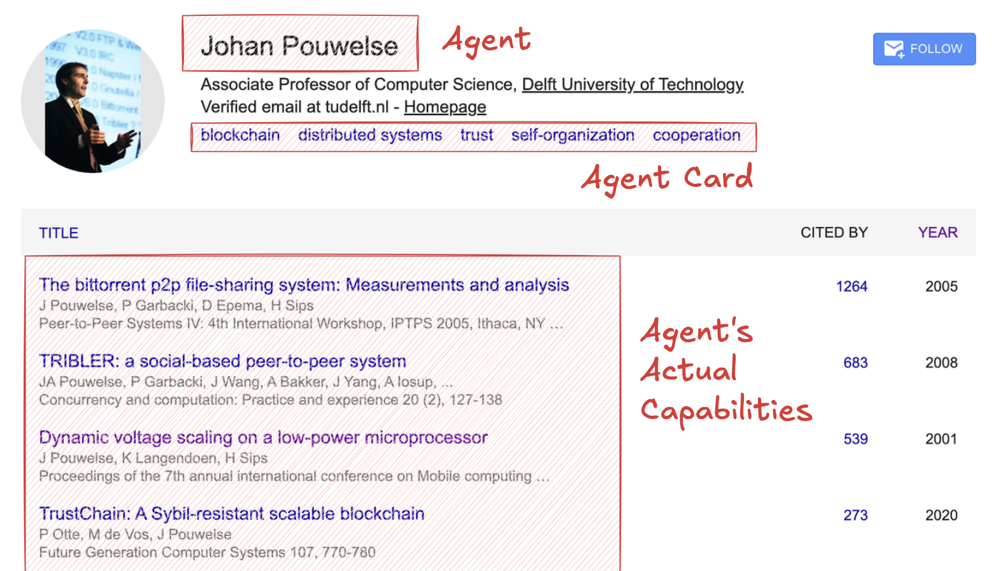
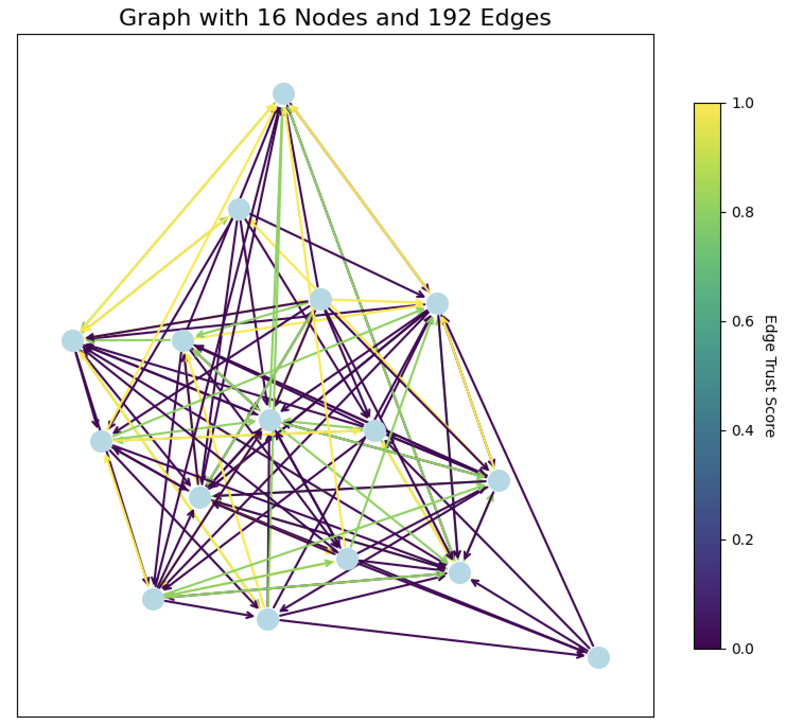

# Agent Search

## Setup Environment

To run this project, you'll need:

1. **Python:** Environment with the required dependencies
2. **Docker:** Deamon must be running
3. **Ollama:** Running with required models

```
# Create conda environment (optional)
conda create -n agentsearch python=3.13
conda activate agentsearch

# Install dependencies, build docker image, and pull models
make install
```

## Dataset Creation

Creating the dataset is a three-step process. The steps are documented below.

To execute the entire pipeline with a single command, use:

```
make dataset
```

### 1. Scrape Agents

This will scrape all Google Scholar profiles with TU Delft affiliation, including names and self-proclaimed research fields (= agent card).

```
python -m scripts.scrape_agents
```



### 2. Download Papers

This will match the scraped agents on Semantic Scholar and attempt to download all linked papers (PDF) with open access.

```
python -m scripts.download
```

### 3. Generate Questions

This will generate five questions for each agent based on their agent card and store them in `data/questions.csv`.

```
python -m scripts.questions
```

### 4. Embedding

In order to save computation time in the experiments, we precompute embeddings for agent cards, questions, and papers.
The latter will be split into chunks on the basis of paragraphs.

```
python -m scripts.embed agents
python -m scripts.embed questions
python -m scripts.embed papers
```

## Experiments

Details of this to be determined. Work in progress! 👷🏻 Currently, we do...

- limit the network to a semantically-close-clustered network of 16 nodes
- source and shuffle questions from all of these nodes
- let each node ask a sample question to the top-3 agents matched by agent card
- evaluate answer on a scale 0-1, make edge
- for test queries: match top agents based on edge prediction

```
python -m agentsearch.graph.graph
```


